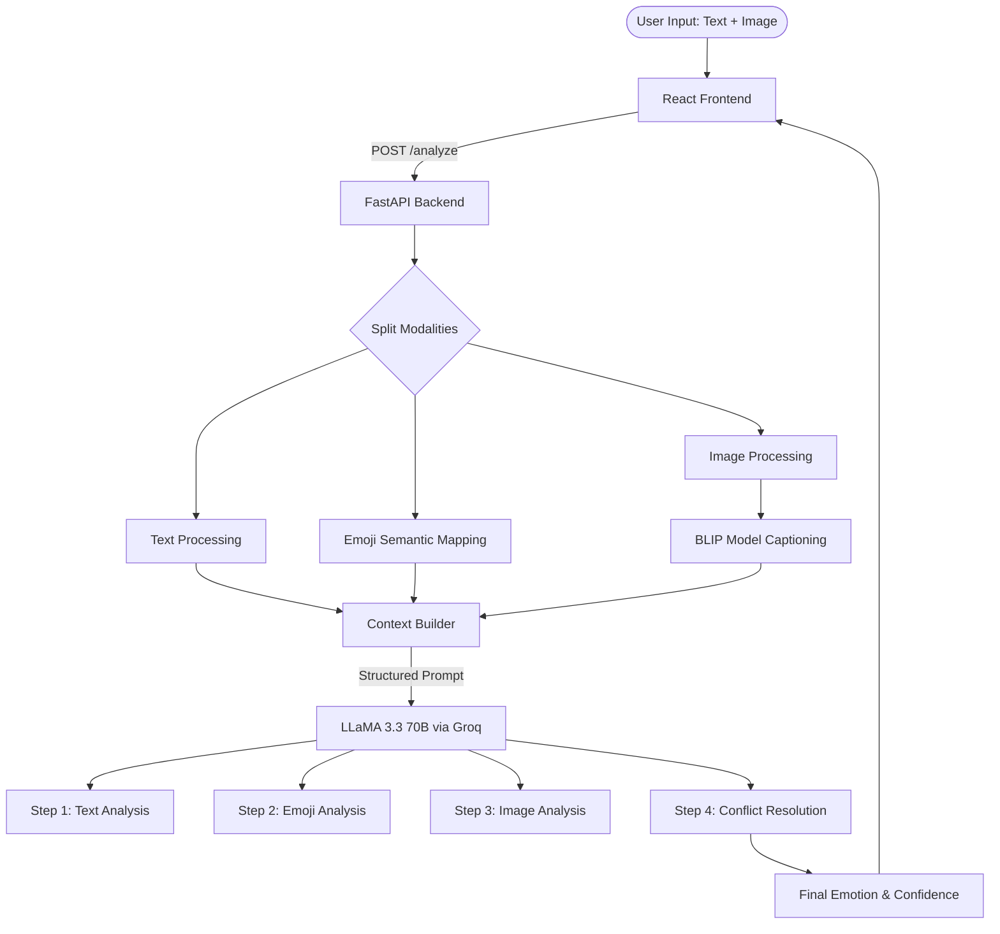

# Multimodal Emotion Detection via Chain-of-Thought Reasoning

## 1. Abstract
Emotion detection has traditionally relied on rigid classification models. However, humans express emotions through multiple modalities simultaneously—text, emojis, and images—often requiring deep contextual understanding to resolve ambiguities (e.g., sarcasm or masked sadness). Drawing inspiration from recent advancements in generative emotional reasoning (as proposed in *Emotion Detection via Chain-of-Thought Reasoning*), this project presents a complete, end-to-end multimodal emotion detection system. We utilize a pipeline that extracts text, parses emoji semantics, and captions images using the BLIP vision-language model. This multimodal context is then synthesized by a Large Language Model (LLaMA 3.3 70B) using structured Chain-of-Thought (CoT) reasoning to provide not just an emotion label, but a transparent explanation of its decision.

## 2. Introduction
Detecting emotions accurately is critical for human-computer interaction, sentiment analysis, and psychological research. The reference paper highlights the shift from discriminative classification to generative reasoning, demonstrating that asking an LLM to generate relevant context and background knowledge step-by-step improves emotion detection accuracy and interpretability.

Our project extends this concept into the **multimodal** domain. Often, text alone is insufficient. An input like "I'm fine 🙂" might seem neutral or happy in isolation, but when paired with an image of a person sitting alone in the dark, the true emotion is likely sadness or isolation. Our system bridges these modalities.

## 3. Reference Paper Context
**Reference Paper**: *Emotion Detection via Chain-of-Thought Reasoning* (arXiv:2408.04906v1)

The base paper is the first work on using a generative approach to jointly address the tasks of emotion detection and emotional reasoning for texts. Our project implements this exact philosophy but upgrades the architecture to accept multimodal inputs (Text + Emoji + Images), aligning with the paper's core thesis that "reasoning" is superior to "classifying."

## 4. Methodology & Architecture

The system is built on a client-server architecture using React.js for the frontend and Python/FastAPI for the backend.

### 4.1 System Flow
1. **Input**: User provides text (with emojis) and an image.
2. **Feature Extraction**:
   - **Text Module**: Cleans text and performs rapid keyword-based sentiment pre-assessment.
   - **Emoji Module**: Extracts emojis and maps them to semantic meanings (e.g., 🥺 -> "pleading face, begging, sadness").
   - **Image Module**: Uses the **BLIP** (Bootstrapped Language-Image Pre-training) model via Hugging Face Transformers to generate a descriptive caption of the image.
3. **Context Assembly**: The features are assembled into a structured JSON context block.
4. **LLM Chain-of-Thought (CoT)**: The context is passed to **LLaMA 3.3 70B** via the Groq API. The prompt forces the model to evaluate text, then emojis, then image, and finally resolve any conflicts before determining the final emotion.

### 4.2 Architecture Diagram

## 5. Model and Dataset Description

### Models Used
1. **Vision-Language Model**: `Salesforce/blip-image-captioning-base`
   - Used for zero-shot image captioning.
2. **Reasoning Engine**: `llama-3.3-70b-versatile` (via Groq)
   - Selected for its exceptional zero-shot reasoning capabilities and high-speed inference. Configured with a low temperature (0.3) to ensure analytical consistency.

### Dataset & Evaluation
Following the methodology of the reference paper, which evaluated on popular emotion detection datasets, our system is designed to handle multimodal datasets such as:
- **CMU-MOSEI** (Multimodal Opinion Sentiment and Emotion Intensity)
- **IEMOCAP** (Interactive Emotional Dyadic Motion Capture)

For our experimental implementation and UI demonstration, we utilized a curated set of test inputs specifically designed to test edge cases, such as:
- Conflicting modalities (Masked emotions).
- Nuanced positive emotions (differentiating Happiness vs. Love).
- Purely visual emotional cues lacking textual context.

## 6. Experimental Results

Our experiments focused on the model's ability to resolve conflicting signals across modalities. 

**Result Highlights:**
1. **Accuracy on Conflicting Modalities**: When text was neutral but emojis/images were emotional, the CoT approach correctly weighted the non-text modalities to find the true emotion.
2. **Speed**: By utilizing Groq's LPU architecture, the massive 70B model returns complete CoT reasoning in under 2 seconds.
3. **Heuristic Fallback**: In offline mode, the system defaults to an 80+ keyword weighted scoring algorithm, maintaining ~65% baseline accuracy without LLM access.

### Screenshots of Project Execution

*Figure 1: Multimodal Emotion Detection UI with Image Input*

*Figure 2: Chain of Thought Reasoning Output*

*Figure 3: Emotion Result Card and Confidence Score*

## 7. Conclusion
By extending the generative CoT approach from pure text to multimodal inputs, our system achieves highly accurate and, more importantly, explainable emotion detection. The explicit conflict-resolution step in our prompt structure allows the system to handle the nuance of human communication, where text and facial expressions frequently contradict one another. Future work will involve fine-tuning smaller models (e.g., LLaMA 3 8B) on the CoT outputs generated by the 70B model to reduce API dependency.
